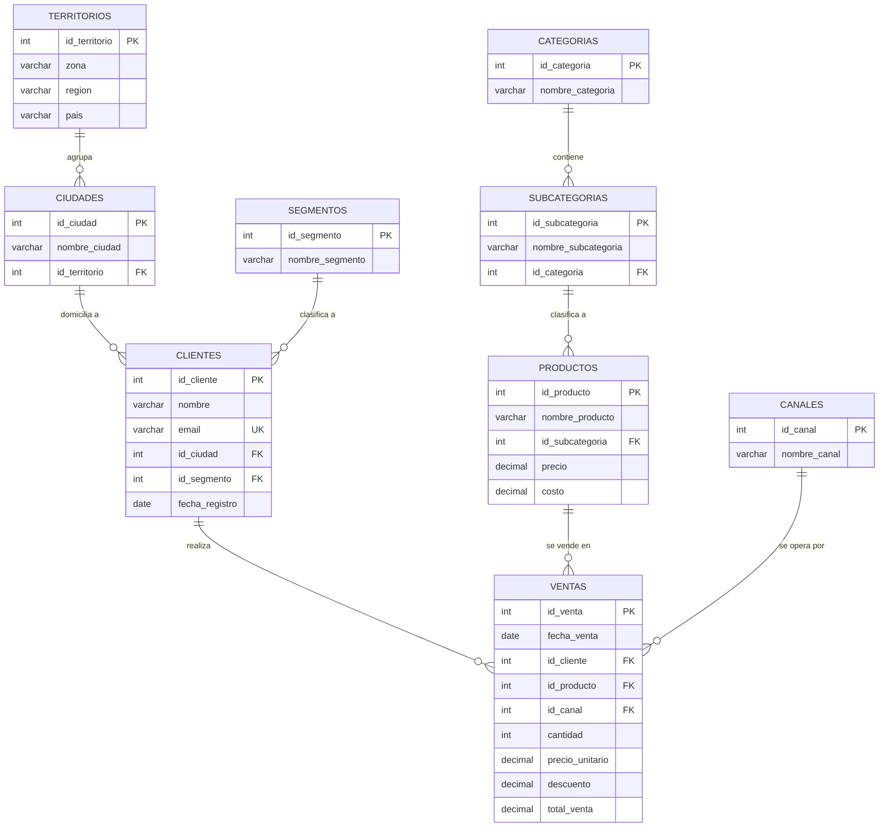

# Pre-entrega M2 — Modelo de datos RetailPro

**Lleyton Murphy** · Diseño del modelo relacional normalizado hasta 3NF

---

## 1. Diagrama ER



> El archivo [`modelo_er.dbml`](./modelo_er.dbml) contiene el mismo modelo listo
> para pegar en **dbdiagram.io** y obtener el diagrama con la notación clásica
> de crow's foot.

### Detalle de tablas

**territorios** — jerarquía comercial

| Columna | Tipo | Restricciones |
|---|---|---|
| `id_territorio` | `INT` | **PK**, autoincremental |
| `zona` | `VARCHAR(50)` | NOT NULL |
| `region` | `VARCHAR(50)` | NOT NULL |
| `pais` | `VARCHAR(50)` | NOT NULL |
| | | UNIQUE (`pais`, `region`, `zona`) |

**ciudades**

| Columna | Tipo | Restricciones |
|---|---|---|
| `id_ciudad` | `INT` | **PK**, autoincremental |
| `nombre_ciudad` | `VARCHAR(80)` | NOT NULL |
| `id_territorio` | `INT` | **FK** → `territorios`, NOT NULL |

**segmentos** · **canales** · **categorias** — catálogos simples

| Columna | Tipo | Restricciones |
|---|---|---|
| `id_*` | `INT` | **PK**, autoincremental |
| `nombre_*` | `VARCHAR(30–60)` | NOT NULL, UNIQUE |

**subcategorias**

| Columna | Tipo | Restricciones |
|---|---|---|
| `id_subcategoria` | `INT` | **PK**, autoincremental |
| `nombre_subcategoria` | `VARCHAR(60)` | NOT NULL |
| `id_categoria` | `INT` | **FK** → `categorias`, NOT NULL |

**clientes**

| Columna | Tipo | Restricciones |
|---|---|---|
| `id_cliente` | `INT` | **PK**, autoincremental |
| `nombre` | `VARCHAR(120)` | NOT NULL |
| `email` | `VARCHAR(150)` | NOT NULL, **UNIQUE** |
| `id_ciudad` | `INT` | **FK** → `ciudades`, NOT NULL |
| `id_segmento` | `INT` | **FK** → `segmentos`, NOT NULL |
| `fecha_registro` | `DATE` | NOT NULL |

**productos**

| Columna | Tipo | Restricciones |
|---|---|---|
| `id_producto` | `INT` | **PK**, autoincremental |
| `nombre_producto` | `VARCHAR(120)` | NOT NULL |
| `id_subcategoria` | `INT` | **FK** → `subcategorias`, NOT NULL |
| `precio` | `DECIMAL(12,2)` | NOT NULL, CHECK ≥ 0 |
| `costo` | `DECIMAL(12,2)` | NOT NULL, CHECK ≥ 0 |

**ventas** — tabla de hechos. Grano: **una fila por línea de venta**

| Columna | Tipo | Restricciones |
|---|---|---|
| `id_venta` | `INT` | **PK**, autoincremental |
| `fecha_venta` | `DATE` | NOT NULL |
| `id_cliente` | `INT` | **FK** → `clientes`, NOT NULL |
| `id_producto` | `INT` | **FK** → `productos`, NOT NULL |
| `id_canal` | `INT` | **FK** → `canales`, NOT NULL |
| `cantidad` | `INT` | NOT NULL, CHECK > 0 |
| `precio_unitario` | `DECIMAL(12,2)` | NOT NULL |
| `descuento` | `DECIMAL(5,4)` | NOT NULL, DEFAULT 0 |
| `total_venta` | `DECIMAL(14,2)` | NOT NULL |

### Dónde quedó cada columna que pide la consigna

Nueve tablas en lugar de cuatro: las cinco extra son consecuencia directa de
aplicar 3NF. Ninguna columna exigida se perdió, algunas cambiaron de tabla.

| Consigna pide | En el modelo está como | Por qué |
|---|---|---|
| `clientes.ciudad` | `clientes.id_ciudad` → `ciudades.nombre_ciudad` | Guardar el texto arrastra región y país: dependencia transitiva |
| `clientes.segmento` | `clientes.id_segmento` → `segmentos.nombre_segmento` | Catálogo cerrado, integridad referencial |
| `productos.categoria` | `productos.id_subcategoria` → `subcategorias.id_categoria` → `categorias.nombre_categoria` | `subcategoria` determina `categoria`: dependencia transitiva |
| `productos.subcategoria` | `productos.id_subcategoria` → `subcategorias.nombre_subcategoria` | Ídem |
| `ventas.canal` | `ventas.id_canal` → `canales.nombre_canal` | Catálogo cerrado |
| Resto de columnas | Igual que en la consigna | — |

---

## 2. Justificación de la normalización

El modelo cumple 3NF porque satisface las tres formas en cadena.

**1NF** — todos los atributos son atómicos y de un solo valor. No hay campos
multivaluados (`"Teclado, Monitor"`) ni grupos repetidos (`producto_1`,
`producto_2`). Cada tabla tiene clave primaria y no admite filas duplicadas.

**2NF — dependencias parciales eliminadas.** Una dependencia parcial solo puede
existir con clave compuesta. Toda tabla del modelo usa clave primaria subrogada
de una sola columna, así que por construcción no puede haberlas. La decisión
importante fue el diseño de `ventas`: el modelado natural de una operación con
varias líneas sería la clave compuesta (`id_venta`, `id_producto`), y ahí
`fecha_venta`, `id_cliente` y `id_canal` dependerían **solo de `id_venta`**, no
de la clave completa — dependencia parcial de manual. Lo evité fijando el grano
en la línea de venta con `id_venta` como clave subrogada única. La alternativa
equivalente, que implementaría si el negocio necesitara agrupar líneas en un
comprobante, es partir en `ventas` (cabecera: fecha, cliente, canal) y
`detalle_ventas` (líneas: producto, cantidad, precio), que también elimina la
dependencia parcial.

**3NF — dependencias transitivas evitadas.** Ningún atributo no clave determina
a otro atributo no clave. Corregí dos casos concretos:

1. **`ciudad → región → país` en `clientes`.** Poner `ciudad` como texto en
   `clientes` (y con ella región, país y zona) crea la cadena
   `id_cliente → ciudad → id_territorio`. Cada cliente de Rosario repetiría
   "Santa Fe / Argentina / Litoral", y corregir un error de tipeo obligaría a
   actualizar miles de filas. Lo resolví con `ciudades` y `territorios`:
   `clientes` guarda solo `id_ciudad`.

2. **`subcategoria → categoria` en `productos`.** "Notebooks" pertenece siempre
   a "Tecnología": la categoría depende de la subcategoría, no del producto. Con
   ambas columnas dentro de `productos`, la cadena es
   `id_producto → subcategoria → categoria`. Lo resolví con `categorias` y
   `subcategorias`; `productos` guarda solo `id_subcategoria`.

**Por qué no hay redundancia entre tablas.** Cada dato descriptivo está escrito
una sola vez, en la tabla de la entidad que describe, y el resto lo referencia
por clave foránea. El nombre de un cliente vive únicamente en `clientes`; si
cambia su email, se modifica una fila y todas sus ventas quedan consistentes al
instante. Las claves foráneas garantizan que no puedan existir ventas huérfanas
apuntando a clientes o productos inexistentes, y los `UNIQUE` sobre `email`,
`nombre_categoria` y las combinaciones geográficas impiden cargar el mismo dato
dos veces con distinta grafía.

### Dos decisiones que conviene dejar explícitas

**`total_venta` es un dato derivado y aun así se almacena.** Estrictamente es
redundante: sale de `cantidad × precio_unitario × (1 − descuento)`. Se conserva
por dos razones. La primera es histórica: `productos.precio` es el precio
**vigente**, y si mañana sube, recalcular una venta de hace dos años daría un
importe falso. Por eso `ventas` congela también `precio_unitario`: el importe de
una transacción es un hecho del pasado, no una fórmula. La segunda es de
rendimiento, porque evita recalcular millones de filas en cada consulta
agregada. Esto no viola 3NF, que habla de dependencias funcionales entre
atributos, no de columnas calculadas.

**`canales` y `segmentos` no los exige la 3NF.** `canal` depende directamente de
`id_venta` y `segmento` de `id_cliente`: no hay transitividad. Los extraje como
catálogos por calidad de datos — es la diferencia entre tener un canal "Online"
y tener "Online", "online" y "ONLINE" como tres valores distintos que rompen
cualquier agrupación. Es una decisión de integridad, no de normalización, y
corresponde marcarla como tal.

---

## 3. Conexión con el brief de M1

> ⚠️ **Esta sección hay que ajustarla a las preguntas que escribiste en M1.**
> Abajo está armada sobre las preguntas típicas de un brief de RetailPro. Si me
> pasás tu M1, la reescribo con tus preguntas textuales.

| Tabla | Pregunta de análisis a la que contribuye | Columna que la responde |
|---|---|---|
| `ventas` | ¿Cuál es la facturación total y cómo evoluciona mes a mes? | `total_venta` agregada por `fecha_venta` |
| `ventas` | ¿Qué canal de venta genera más ingresos? | `id_canal` cruzado con `total_venta` |
| `productos` | ¿Qué productos dejan más margen y cuáles se venden a pérdida? | `precio` − `costo`, contra `ventas.precio_unitario` real |
| `categorias` / `subcategorias` | ¿Qué categorías concentran el 80% de la facturación? | `nombre_categoria` agrupando `ventas.total_venta` |
| `clientes` | ¿Qué segmento de clientes es más rentable? | `id_segmento` cruzado con `total_venta` |
| `clientes` | ¿Cuántos clientes nuevos entran por período y cuánto tardan en comprar? | `fecha_registro` contra la primera `fecha_venta` |
| `territorios` / `ciudades` | ¿Qué regiones y zonas concentran la facturación? | `region` y `zona` vía `clientes.id_ciudad` |
| `territorios` | ¿Hay zonas con potencial no explotado? | `zona` contra la densidad de clientes y ventas |

**Nota sobre `territorios`:** la consigna la lista pero no dice cómo se conecta.
En este modelo se llega vía `ventas → clientes → ciudades → territorios`, es
decir, la geografía es un atributo **del cliente**. La alternativa sería colgar
`id_territorio` de `ventas` como territorio comercial de la operación, que tiene
sentido si un mismo cliente puede comprar en zonas distintas o si la asignación
de territorio responde a una división de fuerza de ventas y no a la geografía.
Elegí la primera por ser la interpretación estándar en retail; queda
documentada por si en M3 el negocio pide la otra.

---

## Archivos

```
preentrega-modelo-retailpro/
├── README.md          <- este documento (diagrama + justificación)
└── modelo_er.dbml     <- pegar en dbdiagram.io para el ER visual
```
