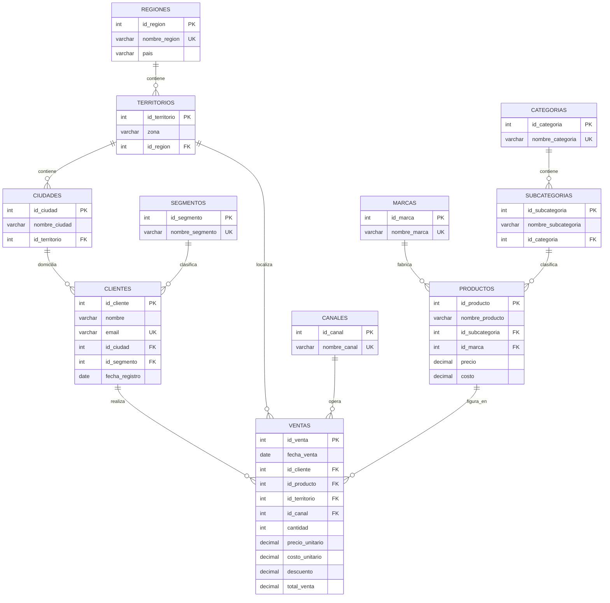

# Pre-entrega M2 — Modelo de datos RetailPro

**Lleyton Murphy** · Modelo relacional normalizado hasta 3NF, alineado al brief de M1

📄 **Documento completo:** https://claude.ai/code/artifact/c73bcff2-830f-48dc-8372-46135a04c20e
📐 **Diagrama ER:** pegar [`modelo_er.dbml`](./modelo_er.dbml) en [dbdiagram.io](https://dbdiagram.io/d)

---

## El modelo



Once tablas en lugar de las cuatro del brief. Las siete extra salen de aplicar
3NF sobre las originales; ninguna columna se perdió, algunas cambiaron de tabla.

## Las tres transitividades eliminadas

| Cadena detectada | Dónde estaba | Cómo se resolvió |
|---|---|---|
| `id_territorio → ciudad → zona → región → país` | `territorios` de M1, todo en una tabla | Tres niveles: `regiones` → `territorios` → `ciudades` |
| `id_producto → subcategoria → categoria` | `productos` | `categorias` + `subcategorias` |
| `id_cliente → id_ciudad → id_territorio` | `clientes` de M1 tenía ambos | Se elimina `clientes.id_territorio` |

**Un caso que parece transitivo y no lo es:** en `regiones`, `pais` depende de
`nombre_region`. Como `nombre_region` es `UNIQUE`, es clave candidata, y la 3NF
admite dependencias sobre claves candidatas. Por eso `pais` se queda ahí sin
necesidad de una cuarta tabla geográfica.

## La dependencia parcial evitada

Con clave compuesta `(id_venta, id_producto)` —el modelado natural de una venta
con varias líneas— `fecha_venta`, `id_cliente`, `id_territorio` y `id_canal`
dependerían solo de `id_venta`, no de la clave completa. Se evita fijando el
grano en la línea de venta con `id_venta` como clave subrogada de una columna.

## Tres decisiones documentadas

1. **`ventas` congela `precio_unitario` y `costo_unitario`.** Los de `productos`
   son los vigentes. El `costo_unitario` lo exige el KPI *Margen Bruto* de M1:
   sin congelarlo, el margen histórico se recalcularía con el costo de hoy.
2. **`total_venta` se almacena aunque sea derivado.** Trazabilidad del importe
   efectivamente facturado y rendimiento en las agregaciones. No viola 3NF.
3. **El grano de `ventas` afecta al KPI Ticket Promedio.** M1 lo define como
   `SUM(total_venta) / COUNT(id_venta)` con `id_venta` = transacción, pero acá
   `id_venta` = línea. Se resuelve partiendo en `ventas` (cabecera) +
   `detalle_ventas` (líneas); conviene decidirlo antes de M3.

## Alineación con M1

El brief plantea `ventas.id_territorio → territorios` y el modelo lo respeta: la
pregunta central es por dónde cayeron las **ventas**, no por dónde viven los
clientes. Un cliente de Córdoba puede comprar en la zona Norte, así que el
territorio de la operación y el domicilio del cliente son datos distintos.

Las seis preguntas de análisis y los seis KPIs del brief están mapeados tabla por
tabla y columna por columna en el documento completo.

**Pendiente:** M1 lista una columna `tipo` en `clientes` además de `segmento`,
pero no la define. No se modeló para no inventar semántica.

## Archivos

```
preentrega-modelo-retailpro/
├── README.md          <- este documento
└── modelo_er.dbml     <- pegar en dbdiagram.io para el ER visual
```
